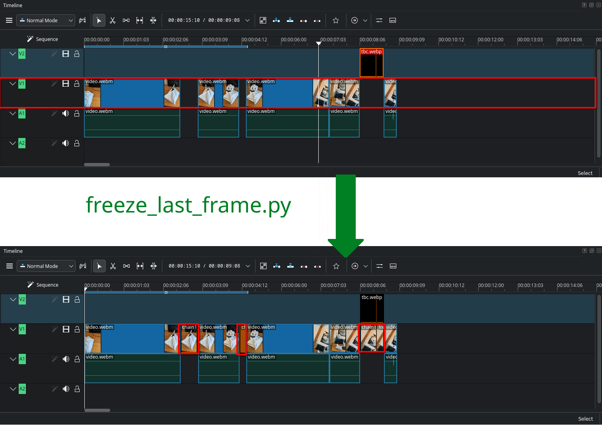
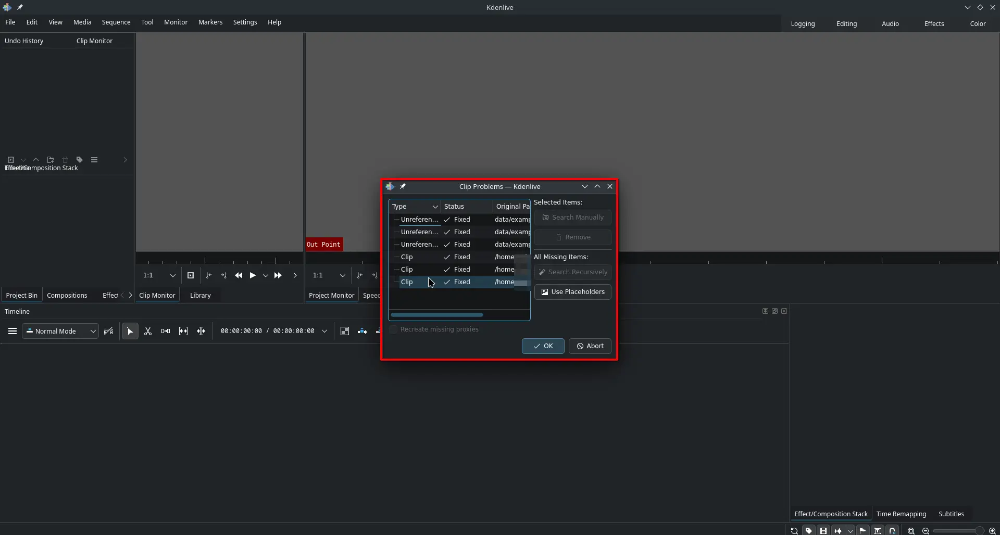

# tad1/kdenlive-scripts

A collection of scripts I needed to use for Kdenlive.  Current scripts:

## Requirements:
- uv
- ffmpeg

## Setup
```sh
git clone https://github.com/tad1/kdenlive-scripts
uv sync
```

### `freeze-last-frame`


For a selected track, freezes the last frame of each clip.
    (if there's a blank space/gap between clips, extracts the last frame as .png and inserts as a new clip filling the blank space)

#### **Usage**

Show help:

```sh
uv run freeze-last-frame -h
```

Interactive mode:

```sh
uv run freeze-last-frame
```

! After running the script you need to open the project to let kdenlive fix its internal references.


### **Example**

in `/data/` there's an example following command should generate working kdenlive project:

```sh
uv run freeze-last-frame ./data/example_project.kdenlive -p playlist4 -o ./data/example_project2.kdenlive -d ./data/example_project2.kdenlive_frames -y
```

